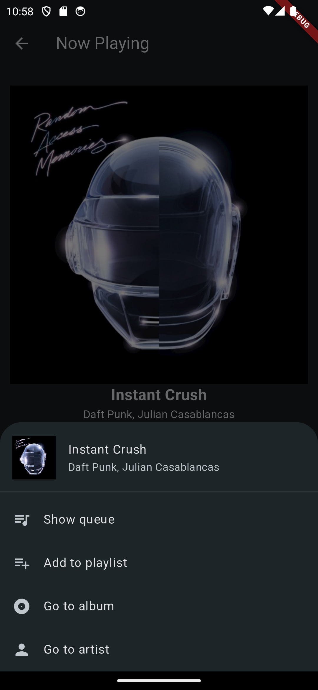
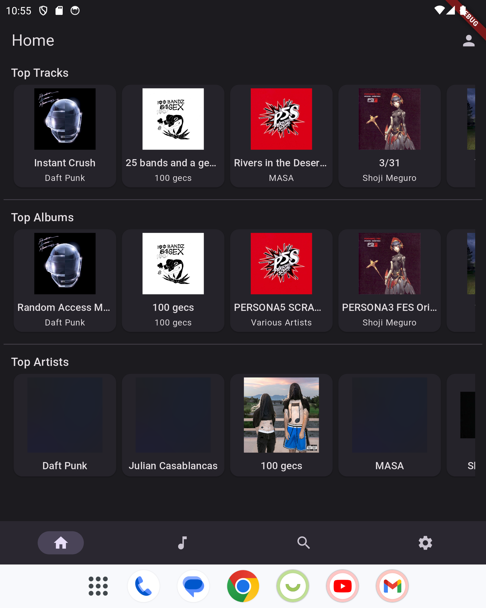
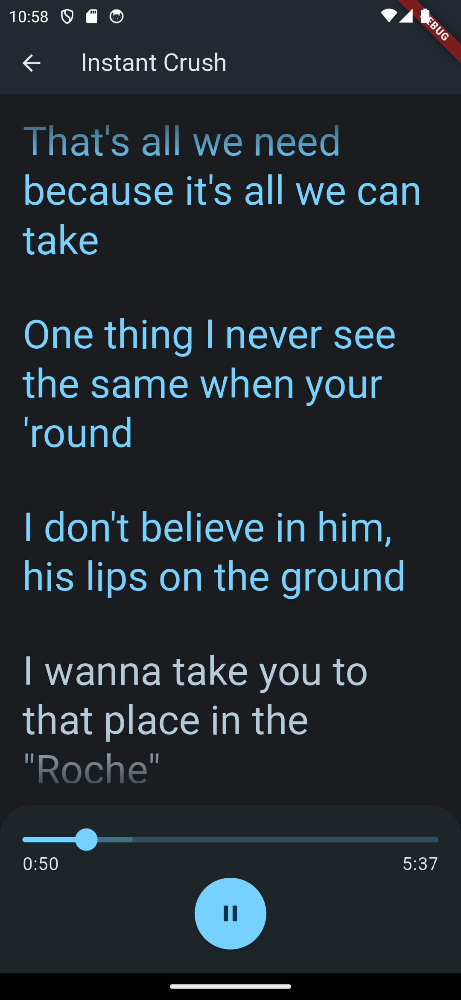
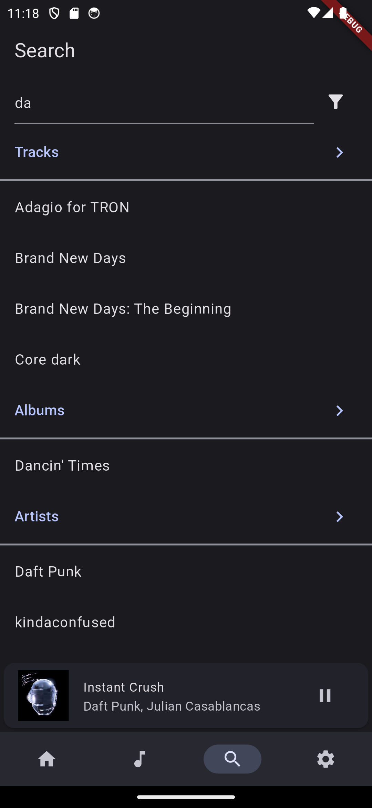

# honeydew
hey, thanks for clicking through!

i'm making honeydew, a flutter-based music player compatible with the melon media server by epsirho.

if you don't know what melon is, that's because it's not out yet. but epsi and i are working hard on it! [go check out his blog!](https://epsirho.com/p/mms-dl2/)

anyway, honeydew targets android and ios, with a goal of building an attractive, functional ui for accessing your music library. check it out! we got:

**music!**

**adaptive design!**

**automatically scrolling lyrics!**

**library search!**

it's coming soon— for real! 
